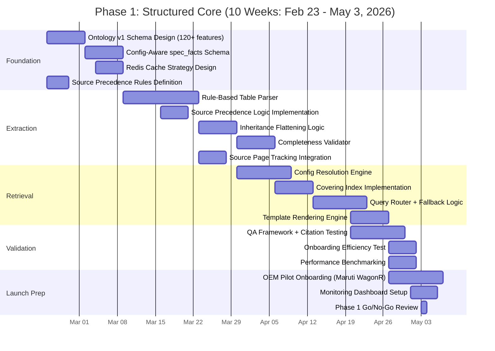
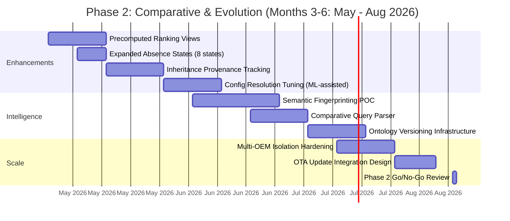

# 🚗 RAG Knowledge Base Architecture: Extraction & Retrieval Modules

*Final Version — Focused exclusively on data extraction and retrieval for automobile OEM voice agents*

**Strategic Principle:** *Structured-first retrieval with deterministic lookup, configuration-aware schema, and controlled fallback. Phase 1 ships velocity; schema enables evolution. Operational efficiency (onboarding <16 hrs/campaign) is the primary success metric.*

---

## 🏗️ High-Level Architecture Overview

```
[OEM Upload]
     ↓
[Document Ingestion Pipeline] → [Layout-Aware Extraction] → [Canonicalization Engine]
     ↓                                                      ↓
[Config-Aware Structuring] → [Completeness Validator] → [Retrieval-Optimized Storage]
     ↓                                                      ↓
[Config Resolution Engine] ←───── [Real-Time Voice Agent Query] ←─── [Query Router]
     ↓                                                      ↓
[Redis Cache Layer] ←───────────────────────────────────────────┘
```

### Phase Strategy

| Phase | Timeline | Focus | Key Deliverables |
| --- | --- | --- | --- |
| **Phase 1** | Weeks 1-10 | Ship deterministic lookup | Config-aware schema, O(1) retrieval, citation trust, <16hr onboarding |
| **Phase 2** | Months 3-6 | Enable comparative queries | Precomputed rankings, expanded absence states, config inference tuning |
| **Phase 3** | Months 6+ | Semantic evolution | Fingerprinting, inheritance provenance, OTA support |

**Core Design Choice:** Store configuration axes explicitly from Day 1, but simplify runtime logic for Phase 1 velocity. **Operational Discipline:** Completeness validation and config resolution are non-negotiable for determinism.

---

## 📦 Core Extraction Modules

### 1. **Document Ingestion & Pre-Processing Module**

*Purpose: Convert raw uploads into structured, layout-aware data for canonicalization*

| Component | Technology (Phase 1) | Key Function |
| --- | --- | --- |
| **File Type Router** | MIME detection + magic bytes | Route PDFs, images, DOCX to appropriate parsers |
| **Source Precedence Engine** | Rule-based priority queue | **NEW:** Enforce order: Spec Sheet > Brochure > Marketing PDF. Prevents silent overrides. |
| **PDF Parser** | PyMuPDF + pdfplumber + OCR (Tesseract) | Extract text, tables, images with position metadata |
| **Page Classifier** | Rule-based + lightweight LayoutLM | Tag pages: `spec_table`, `marketing`, `color_grid`, `dimensional_diagram`, `disclaimer` |
| **Table Detector** | Camelot + Tabula + regex fallback | Identify bounding boxes of tables; handle multi-table pages |
| **Image Processor** | OpenCV for swatches + simple OCR | Extract color names; map to hex; flag dimensional diagrams for manual review |

**Critical Design**: Only pages tagged `spec_table` or `dimensional_diagram` proceed to deep extraction. Marketing pages go to separate USP extraction pipeline (Phase 2).

**Source Precedence Logic**:

```python
# Prevents conflicting data from multiple uploads
PRECEDENCE_ORDER = {
    "spec_sheet": 1,  # Highest trust
    "brochure": 2,
    "marketing_collateral": 3
}
# If feature exists in higher precedence source, ignore lower precedence values
```

---

### 2. **Layout-Aware Table Extraction Module**

*Purpose: Parse complex variant-feature matrices like WagonR Page 5*

```python
# Pseudo-logic for variant-aware table parsing (Phase 1)
def parse_variant_table(table_image, context_metadata):
    # Step 1: Detect header hierarchy (rule-based for Phase 1)
    headers = detect_multi_level_headers(table_image)
    # e.g., ["FEATURES", "1.0L", "1.2L"] → ["LXi", "VXi", "ZXi", "ZXi+"]

    # Step 2: Extract feature rows with symbol interpretation
    rows = []
    for row in table_rows:
        feature_name = normalize_feature_name(row[0])  # "Power Windows (Fr/Rr)" → "power_windows"
        variant_values = {}
        for variant_col, cell in zip(variants, row[1:]):
            value = interpret_symbol(cell)  # "✓" → True, "-" → None, "√ (Optional)" → {"available": True, "condition": "optional"}
            variant_values[variant_col] = value
        rows.append({"feature": feature_name, "variants": variant_values})

    # Step 3: Attach contextual metadata + FLATTEN inheritance for Phase 1
    return {
        "source_page": context_metadata["page"],  # CRITICAL for citation
        "source_priority": PRECEDENCE_ORDER[context_metadata["doc_type"]],
        "table_type": "variant_matrix",
        "powertrain_context": context_metadata["engine"],
        "data": expand_inheritance(rows, variants)  # Phase 1: duplicate rows for inherited features
    }
```

**Key Capabilities (Phase 1)**:

- ✅ Handle merged cells and nested headers via rule-based parsing
- ✅ Interpret symbols: `✓`/`✗`//`O`/ with footnote resolution
- ✅ Preserve conditional logic: `"Dual Tone": {"available": true, "condition": "optional_package_xyz"}`
- ✅ Link disclaimers to relevant features via spatial proximity + store `source_page`
- ✅ **Flatten inheritance at ingestion**: If ZXi inherits VXi features, write explicit rows for ZXi

**Why Flatten for Phase 1?**

- Eliminates runtime inheritance logic → O(1) retrieval
- Storage cost increase ~30% (acceptable per requirements)
- Re-extraction on brochure update is batch operation (no real-time impact)

---

### 3. **Dynamic Ontology & Semantic Normalization Module**

*Purpose: Resolve nomenclature variations with a versioned, extensible foundation*

### Ontology Structure (Phase 1: Static v1 + Synonym Map)

```yaml
ontology_version: "automotive_core_v1.0"
release_date: "2024-Q1"
coverage_target: 120+ core features  # Expanded from 80 to reduce fallback rate

terms:
  fuel_efficiency:
    category: "performance"
    data_type: "numeric"
    units: ["kmpl", "mpg", "l/100km"]
    default_unit_by_region:
      IN: "kmpl"
      US: "mpg"
      EU: "l/100km"
    synonyms: ["mileage", "fuel economy", "consumption", "milage"]  # Phase 1: simple list
    validation:
      min_value: 5
      max_value: 50
    answer_template: "The ARAI certified mileage is {value} {unit}."  # Single template for Phase 1

  power_windows:
    category: "comfort_convenience"
    data_type: "categorical"
    values: ["front_only", "rear_only", "front_and_rear", "not_available"]
    synonyms: ["electric windows", "auto windows", "power glass"]
    answer_template: "Power windows are {value}."
```

### Term Resolution Pipeline (Phase 1)

```
Brochure Term: "Milage"
       ↓
[Synonym Lookup] → Match: "fuel_efficiency" (confidence: 0.98)
       ↓
[Unit Detection] → "24.3 kmpl" → numeric: 24.3, unit: "kmpl"
       ↓
[Region Context] → India → Keep "kmpl" (no conversion needed)
       ↓
[Ontology Validation] → Term exists in v1.0 → Proceed
       ↓
[If New Term Detected] → Flag for admin review + store in ext_unreviewed namespace
```

**Extensibility Mechanism (Phase 1 Manual Process)**:

```python
# Admin workflow for adding new terms (not API-driven in Phase 1)
def propose_new_term(raw_term: str, example_values: list, category_hint: str):
    """
    Creates a ticket for SME review.
    Approved terms are added to ontology YAML + deployed via CI/CD.
    No runtime API to prevent uncontrolled drift.
    """
    review_queue.add({
        "raw_term": raw_term,
        "examples": example_values,
        "suggested_category": category_hint,
        "status": "pending_review"
    })
```

**Phase 2+ Evolution**: Add semantic fingerprinting, versioned term definitions, and runtime compatibility checks.

---

### 4. **Config-Aware Data Structuring Module**

*Purpose: Model feature availability across configuration axes with flattening for Phase 1 speed*

### Core Schema: `spec_facts` (Phase 1)

```sql
CREATE TABLE spec_facts (
    -- Primary Key: Deterministic O(1) Lookup
    derived_variant_id TEXT PRIMARY KEY,  -- Hash: md5(model_code|model_year|trim|engine|trans|fuel|region)

    -- Structural Axes (Explicit Columns for Future-Proofing)
    oem_id TEXT NOT NULL,
    campaign_id TEXT NOT NULL,            -- Marketing campaign boundary
    model_code TEXT NOT NULL,
    model_year INT NOT NULL,
    region TEXT NOT NULL,
    trim TEXT,                            -- 'VXi', 'ZXi', etc.
    engine_code TEXT,                     -- 'K12N', 'K10M', etc.
    transmission TEXT,                    -- 'MT', 'AMT', 'CVT'
    fuel_type TEXT,                       -- 'petrol', 'CNG', 'hybrid', 'electric'
    drive_type TEXT DEFAULT 'FWD',        -- Future-proof for AWD

    -- Feature Identity (Ontology-Bound)
    feature_id TEXT NOT NULL,             -- 'fuel_efficiency', NOT "Milage"
    category TEXT NOT NULL,               -- 'performance', 'safety', etc.

    -- Value & State (Phase 1 Simplified)
    value_json JSONB NOT NULL,            -- { "numeric": 24.3, "unit": "kmpl", "text": "ARAI Certified" }
    availability_state TEXT CHECK (
        availability_state IN ('standard', 'optional', 'not_available', 'not_mentioned')
    ),

    -- Trust & Audit (Non-Negotiable for Voice)
    source_doc_id TEXT NOT NULL,          -- Link to uploaded brochure
    source_page INT NOT NULL,             -- CRITICAL: "Per page 5 of the brochure"
    source_priority INT NOT NULL,         -- For conflict resolution
    extraction_confidence FLOAT CHECK (extraction_confidence BETWEEN 0 AND 1),

    -- Retrieval Optimization (Denormalized)
    search_keywords TEXT[],               -- ['mileage', 'fuel economy', 'kmpl'] for fallback
    precomputed_value_display TEXT,       -- "24.3 kmpl" (region-normalized, NOT full sentence)

    -- Indexes
    UNIQUE(oem_id, model_code, model_year, trim, engine_code, transmission, fuel_type, region, feature_id),
    INDEX idx_variant_lookup (derived_variant_id, feature_id) INCLUDE (value_json, availability_state, source_page),
    INDEX idx_model_filter (model_code, model_year, region, feature_id),
    INDEX idx_keyword_fallback (oem_id, model_code, feature_id) USING GIN (search_keywords)
);
```

**Key Design Choices (Phase 1)**:

- 🔄 **Explicit axes, flattened logic**: Store `trim`, `engine`, etc. as columns, but flatten inheritance at ingestion → no runtime joins
- 🎯 **`derived_variant_id` as hash**: Enables O(1) lookup while preserving ability to filter by individual axes later
- 📦 **`value_json` not pre-rendered sentences**: Store structured values; render templates at query time (decouples data from presentation)
- 🔗 **`source_page` mandatory**: Every fact links to brochure page for voice citation ("According to page 5...")
- ✅ **Completeness Invariant**: **NEW** - Every `derived_variant_id` MUST have a row for every ontology feature (even if `not_mentioned`).

### Completeness Validator (Offline Post-Ingestion)

```python
def validate_completeness(campaign_id, ontology_v1):
    """
    Ensures deterministic lookup never fails due to missing rows.
    """
    variants = get_all_derived_variant_ids(campaign_id)
    for variant in variants:
        for feature in ontology_v1.all_features():
            if not db.exists(variant, feature):
                db.insert({
                    "derived_variant_id": variant,
                    "feature_id": feature.id,
                    "availability_state": "not_mentioned",
                    "value_json": {},
                    "source_page": 0,  # Indicates synthetic row
                    "extraction_confidence": 1.0
                })
```

---

### 5. **Retrieval-Optimized Chunking & Indexing Strategy**

*Purpose: Enable sub-200ms query response for voice agents with deterministic primary path*

### Dual-Layer Indexing (Phase 1)

| Index Type | Purpose | Technology | Latency Target |
| --- | --- | --- | --- |
| **Primary: Covering Index** | Deterministic lookup by `derived_variant_id` + `feature_id` | PostgreSQL B-Tree + INCLUDE | ~15ms |
| **Fallback: Keyword GIN** | Handle synonym mismatches (e.g., "milage" → "fuel_efficiency") | PostgreSQL GIN on `search_keywords` | ~25ms |
| **Optional: Vector Fallback** | Ambiguous/marketing queries (<5% target) | Qdrant/Pinecone with OEM filter | ~60ms |

### Redis Cache Structure (Phase 1)

```json
{
  "cache_key": "spec:maruti_suzuki:wagonr:2024:VXi:K12N:AMT:petrol:IN",
  "ttl_seconds": 86400,
  "payload": {
    "fuel_efficiency": {
      "value_json": {"numeric": 24.3, "unit": "kmpl"},
      "availability_state": "standard",
      "source_page": 5,
      "precomputed_value_display": "24.3 kmpl"
    },
    "power_windows": {
      "value_json": {"scope": "front_and_rear"},
      "availability_state": "standard",
      "source_page": 5,
      "precomputed_value_display": "front and rear"
    }
  }
}
```

**Query Flow (Phase 1)**:

```
Voice Query: "What's the mileage of the automatic WagonR?"
       ↓
[Configuration Resolution Engine] (NEW)
- Infer: model=wagonr, transmission=AMT
- Check: Does VXi have AMT? Yes. Does LXi have AMT? No.
- Resolve: User likely means VXi (default high-volume variant) OR trigger clarification.
- Generate: derived_variant_id = hash(wagonr|2024|VXi|K12N|AMT|petrol|IN)
       ↓
[Redis Cache Lookup] (Primary Path - 90%+ of queries)
- Key: spec:{derived_variant_id}
- Hit: Return structured fact + source_page
- Miss: Fall through to PostgreSQL
       ↓
[PostgreSQL Covering Index] (Cache Miss Path)
- Query: SELECT value_json, availability_state, source_page
         FROM spec_facts
         WHERE derived_variant_id = $1 AND feature_id = $2
- Latency: ~15ms (index seek + covering columns)
       ↓
[Keyword Fallback] (If feature_id resolution fails)
- Query: SELECT ... FROM spec_facts
         WHERE model_code=$1 AND feature_id IN (
           SELECT term_id FROM ontology_synonyms WHERE synonym ILIKE $2
         )
- Log mismatch for ontology review
       ↓
[Vector Fallback] (<5% of queries - ambiguous intent)
- Filter: oem_id + model_code only (no variant)
- Return top result with confidence <0.8 flag
       ↓
[Response Assembly]
{
  "answer": render_template(feature_id, value_json),  // "The ARAI certified mileage is 24.3 kmpl."
  "citation": f"According to page {source_page} of the brochure",
  "confidence": "high" | "medium" | "low",
  "source": {
    "document": source_doc_id,
    "page": source_page,
    "extraction_confidence": 0.98
  }
}
```

**Performance Optimizations (Phase 1)**:

- 🚀 **Covering indexes**: Return all needed columns without table lookup
- 🔄 **Redis TTL 24h**: Cache invalidation aligned with brochure update cycles
- 🎯 **Precomputed `precomputed_value_display`**: "24.3 kmpl" not full sentence → template rendering at query time
- 📊 **Query logging**: Every fallback path logged with raw query → trigger ontology review if >5% fallback rate

---

### 6. **Query Processing & Retrieval Optimization Module**

*Purpose: Transform voice agent queries into optimized retrieval operations with trust-first design*

### Configuration Resolution Engine (NEW - Critical for Voice)

```python
def resolve_configuration(user_query, campaign_context):
    """
    Infers missing config axes from ambiguous voice input.
    """
    entities = nlu.extract(user_query)  # {model: 'wagonr', transmission: 'automatic'}

    # Step 1: Load valid config combinations for this model
    valid_configs = db.query(
        "SELECT DISTINCT trim, engine_code, transmission, fuel_type FROM spec_facts WHERE model_code=$1",
        [entities.model]
    )

    # Step 2: Apply Inference Rules
    inferred_config = {}
    if not entities.get('trim'):
        # Rule: If unspecified, default to highest volume variant (e.g., VXi)
        inferred_config['trim'] = get_default_trim(entities.model, campaign_context.region)
    else:
        inferred_config['trim'] = entities.trim

    if not entities.get('engine'):
        # Rule: If only one engine exists for this trim, infer it
        valid_engines = [c.engine_code for c in valid_configs if c.trim == inferred_config['trim']]
        if len(valid_engines) == 1:
            inferred_config['engine'] = valid_engines[0]
        else:
            # Ambiguity detected → Trigger clarification
            return ClarificationRequest(options=valid_engines)

    # Step 3: Generate derived_variant_id
    return generate_variant_id(**inferred_config, **entities)
```

### Query Understanding Pipeline (Phase 1)

```
Voice Query: "Does the WagonR VXi have dual tone roof option?"
       ↓
[Query Normalizer]
- Normalize terms: "dual tone roof" → ontology lookup → feature_id: "dual_tone_exterior"
- Extract entities: model=wagonr, trim=VXi, feature=dual_tone_exterior
- Detect intent: availability_check (binary yes/no/optional)
       ↓
[Retrieval Planner]
1. Primary: Exact match on (derived_variant_id, feature_id) in Redis/PostgreSQL
2. Fallback: Keyword search on search_keywords if feature_id resolution failed
3. Last Resort: Vector search with same-OEM filter (logged + low confidence)
       ↓
[Result Assembly with Citation]
{
  "answer": "Yes, the WagonR VXi offers Dual Tone Exterior as an optional package.",
  "citation": "According to page 5 of the brochure",
  "spec_details": {
    "feature": "dual_tone_exterior",
    "availability_state": "optional",
    "source_page": 5
  },
  "confidence": "high"
}
```

### Template Rendering (Decoupled from Data)

```python
# Ontology-owned templates (Phase 1: single template per feature)
def render_answer(feature_id: str, value_json: dict, context: VoiceContext) -> str:
    template = ontology.get_template(feature_id)  # e.g., "The ARAI certified mileage is {value} {unit}."

    variables = {
        "value": value_json.get("numeric", value_json.get("text")),
        "unit": value_json.get("unit", ""),
        "scope": value_json.get("scope", ""),  # for categorical features
    }

    return template.format(**variables)

# Example calls:
render_answer("fuel_efficiency", {"numeric": 24.3, "unit": "kmpl"}, context)
# → "The ARAI certified mileage is 24.3 kmpl."

render_answer("power_windows", {"scope": "front_and_rear"}, context)
# → "Power windows are front and rear."
```

**Benefits of Template-First (vs. Precomputed Snippets)**:

- ✅ Truth layer remains pure structured data
- ✅ Voice persona changes require no data migration (change template, not facts)
- ✅ Regional dialects handled via template selection (Phase 2)
- ✅ Cache rendered answers with composite key: `rendered:{fact_id}:{template_id}:{region}`

### Confidence & Trust Signaling

```python
def determine_confidence(query_path: str, extraction_confidence: float, fallback_used: bool) -> str:
    if query_path == "primary" and extraction_confidence >= 0.95:
        return "high"  # Voice agent: "I'm confident that..."
    elif query_path == "keyword_fallback" or extraction_confidence >= 0.85:
        return "medium"  # Voice agent: "Based on the brochure..."
    else:
        return "low"  # Voice agent: "I don't have that specific detail..." + suggest escalation
```

---

## 🔒 Cross-OEM Isolation & Same-OEM Cross-sell

### Tenant Isolation Architecture (Phase 1)

```
Database Level:
- Partition key: oem_id + campaign_id
- Row-level security policy: WHERE oem_id = current_setting('app.current_oem_id')
- Separate Redis key prefixes per OEM: spec:{oem_id}:...

Application Level:
- Query router validates OEM context before execution (middleware)
- All queries include oem_id + campaign_id filters (no exceptions)
- Audit log for all cross-OEM access attempts (alert on any match)

Vector Index Level (if used):
- Separate collections per OEM in Qdrant/Pinecone
- Metadata filter: oem_id MUST match query context
```

### Same-OEM Cross-sell Enablement (Phase 1 Simple)

```python
# Precomputed same-OEM upgrade paths (static config for Phase 1)
OEM_UPGRADE_PATHS = {
    "maruti_suzuki": {
        "wagonr": {
            "next_tier": ["ciaz", "brezza"],  # For "upgrade" intent
            "reason_tags": ["more_power", "premium_features", "suv_segment"]
        }
    }
}

# Query-time logic (only triggered for explicit upgrade intents)
if query_intent == "upgrade_inquiry" and current_model in OEM_UPGRADE_PATHS[oem_id]:
    suggestions = [
        {"model": m, "reason": OEM_UPGRADE_PATHS[oem_id][current_model]["reason_tags"][0]}
        for m in OEM_UPGRADE_PATHS[oem_id][current_model]["next_tier"]
    ]
    # Return as optional add-on to primary answer
    response.cross_sell_suggestions = suggestions
```

**Critical Boundary**: Cross-sell logic ONLY triggers on explicit upgrade intent. Never leak competitor data.

---

## 🌐 Handling Brochure Complexity: WagonR-Specific Solutions

| Challenge | Phase 1 Solution | Phase 2+ Evolution |
| --- | --- | --- |
| **Multiple tables on one page** | TableDetector returns list of bounding boxes; each processed independently with shared vehicle context | Add spatial relationship modeling for footnote linking |
| **Variant columns (LXi, VXi, etc.)** | Header parser identifies variant names; create explicit rows per variant (flatten inheritance) | Lazy inheritance resolution with provenance tracking |
| **Conditional features** | Regex detects "optional", "available with"; store condition in `value_json["conditions"]` | Structured condition graph with package dependencies |
| **Color swatches** | OpenCV extracts color blocks + OCR for names; map to standardized taxonomy with hex codes | Vision model for complex swatch grids |
| **Dimensional diagrams** | Flag for manual review queue if confidence <0.9; fallback to text extraction | GPT-4V/Donut for annotated image parsing |
| **Mixed units & nomenclature** | Ontology synonym map + unit converter with region context (India → kmpl) | Semantic fingerprinting for term meaning drift |
| **Footnotes & disclaimers** | Spatial proximity linking: footnote symbol → nearest feature cell; store in `value_json["conditions"]` | Full disclaimer graph with conditional logic evaluation |

**WagonR Page 5 Specific Handling**:

```python
# Special parser for variant matrix pages (Phase 1)
def parse_wagonr_p5(table_data, brochure_metadata):
    # Detect variant headers: ["LXi", "VXi", "ZXi", "ZXi+"]
    variants = extract_variant_headers(table_data.headers)

    # Parse each feature row
    facts = []
    for row in table_data.rows:
        feature_raw = row[0]  # "Power Windows (Fr/Rr)"
        feature_id = ontology.resolve(feature_raw)  # "power_windows"

        # Parse variant cells
        for variant, cell in zip(variants, row[1:]):
            # Generate derived_variant_id for this specific config
            variant_id = generate_variant_id(
                model_code="wagonr",
                model_year=2024,
                trim=variant,
                engine_code=brochure_metadata["engine"],  # "K12N" or "K10M"
                transmission=brochure_metadata["transmission"],
                fuel_type=brochure_metadata["fuel"],
                region="IN"
            )

            # Interpret cell value
            value, state = interpret_cell(cell)  # "√" → ({"scope": "front_and_rear"}, "standard")

            # Create fact row (FLATTEN: no inheritance logic)
            facts.append(SpecFact(
                derived_variant_id=variant_id,
                feature_id=feature_id,
                value_json=value,
                availability_state=state,
                source_page=5,  # CRITICAL for citation
                extraction_confidence=0.97
            ))

    return facts
```

---

## 📈 Scalability & Evolution Mechanisms

### Horizontal Scaling Strategy (Phase 1)

```
Document Processing:
- Kafka queue for ingestion tasks (decouple upload from extraction)
- Kubernetes pods for extraction workers (auto-scale on queue depth)
- Stateless workers: any pod can process any OEM's document

Query Serving:
- PostgreSQL read replicas for spec_facts table
- Redis cluster for caching with consistent hashing
- Vector DB (if used) sharded by oem_id

Monitoring:
- Prometheus metrics: query_latency_p95, fallback_rate, cache_hit_rate
- Alerting: fallback_rate >5% → trigger ontology review
```

### **Operational Efficiency: Onboarding Speed** (NEW KPI)

```
Target: <16 Engineer-Hours per OEM Campaign

Breakdown:
- Document Upload & Pre-processing: 1 hour (Automated)
- Extraction QA & Validation: 4 hours (Human-in-loop)
- Ontology Mapping (New Terms): 4 hours (SME Review)
- Completeness Validation: 2 hours (Automated)
- Integration Testing: 5 hours (Automated + Manual)

Scaling Mechanism:
- Week 1-4: Manual ontology mapping (high touch)
- Week 5-8: Semi-automated synonym suggestion (ML-assisted)
- Week 9+: Fully automated for core 120 features (exception-based)
```

### Handling New Technologies (Phase 1 → Phase 2 Path)

```
Step 1: Brochure mentions new term (e.g., "hydrogen_storage_capacity")
→ Extraction flags as ext_unreviewed_hydrogen_storage
→ Stored in spec_facts with feature_id = "ext_unreviewed_hydrogen_storage"
→ Query path: keyword fallback only (logged for review)

Step 2: SME reviews + approves term
→ Added to ontology YAML v1.1
→ Deployed via CI/CD (no downtime)
→ Backfill script updates ext_unreviewed_* rows to core feature_id

Step 3: New brochures with synonyms
→ "H2 tank size" → synonym map → direct core lookup
→ No migration needed for new data
```

**Key Principle**: New terms are queryable immediately (via fallback) but flagged for review. Promotion to core is batch operation.

### Monitoring & Quality Gates (Phase 1)

```yaml
extraction_quality_metrics:
  - table_parsing_accuracy: target >95% (human review sample)
  - variant_mapping_correctness: target >95%
  - ontology_match_confidence: alert if <0.7 for >5% of extractions
  - query_latency_p95: target <200ms (alert if >250ms)
  - fallback_usage_rate: target <10% (alert if >15%)
  - onboarding_time_per_campaign: target <16 hours (alert if >20)

trust_metrics:
  - citation_coverage: % of responses with source_page (target: 100%)
  - confidence_distribution: track high/medium/low split
  - fallback_query_log: sample raw queries for ontology expansion
  - completeness_validation_pass_rate: target 100% (blocking deployment)

alerting:
  - extraction_failure_rate >5% → page extraction team
  - query_latency_p99 >500ms → scale query pods
  - fallback_rate >10% for 1 hour → trigger ontology review workflow
  - cross_oem_query_attempt → security alert (should be 0)
  - completeness_validation_fail → BLOCK deployment
```

---

## ⚡ Performance Targets & Trade-offs

| Metric | Phase 1 Target | How Achieved | Trade-off Accepted |
| --- | --- | --- | --- |
| **Extraction latency** | <60 sec/page | Parallel table processing; rule-based parsing | Accuracy >95% sufficient; human review queue for low-confidence |
| **Query latency (p95)** | <200ms | Redis cache + covering indexes + O(1) derived_variant_id lookup | Storage redundancy: ~3x for flattened inheritance + denormalized keywords |
| **Retrieval accuracy** | >99.5% for primary path | Deterministic lookup + explicit config axes + Completeness Validator | Fallback paths logged + monitored; not hidden from metrics |
| **Citation coverage** | 100% of responses | source_page mandatory in spec_facts schema | Slightly longer extraction pipeline to capture page numbers |
| **Cross-OEM isolation** | 0 leakage incidents | oem_id in every query filter + row-level security + audit logs | Slightly more complex query routing logic |
| **Fallback usage** | <10% of queries | Strong ontology v1 (120+ features) + synonym map + config-aware parsing | Vector search included but strictly logged + low-confidence |
| **Onboarding Speed** | <16 hours/campaign | Automated completeness validation + semi-automated ontology mapping | Initial SME effort high; decreases with ontology maturity |

**Explicit Trade-off Statement**: We accept 3-5x storage overhead and simplified inheritance logic to eliminate runtime joins and enable sub-200ms voice responses. Structural correctness (config axes) is non-negotiable; logical complexity (inheritance resolution) is deferred to Phase 2. **Operational Efficiency** is prioritized via automated validation.

---

## 🚀 Implementation Roadmap (Extraction & Retrieval Only)



### Phase 2+ Preview (Post-Launch)



---

## 📅 Key Milestones

| Milestone | Date | Deliverable |
| --- | --- | --- |
| **Project Kickoff** | Feb 23, 2026 | Architecture sign-off, team allocation |
| **Ontology v1 Frozen** | Mar 1, 2026 | 120+ core features, synonym maps, templates |
| **Schema Deployed** | Mar 9, 2026 | `spec_facts` table + indexes in staging |
| **Extraction MVP Ready** | Mar 30, 2026 | Rule-based parser + completeness validator |
| **Retrieval MVP Ready** | Apr 20, 2026 | Config resolver + query router + templates |
| **QA Complete** | Apr 30, 2026 | Citation coverage 100%, latency <200ms p95 |
| **Pilot Onboarding** | May 3, 2026 | Maruti WagonR campaign live (<16 hr onboarding) |
| **Phase 1 Launch** | May 3, 2026 | Go/No-Go decision for production rollout |
| **Phase 2 Kickoff** | May 4, 2026 | Begin comparative query enhancements |

---

## 🔄 Timeline Dependencies

```
Week 1-2 (Feb 23 - Mar 8)
├─ Ontology v1 design blocks all downstream work
├─ Source precedence rules must be defined before extraction
└─ Schema design must be frozen before indexing work begins

Week 3-5 (Mar 9 - Mar 29)
├─ Table parser must be validated before completeness validator
├─ Inheritance flattening logic depends on parser output
└─ Config resolution engine can be developed in parallel

Week 6-8 (Mar 30 - Apr 19)
├─ Query router depends on config resolver + ontology
├─ Template engine depends on ontology v1 templates
└─ Covering indexes can be tuned once query patterns are known

Week 9-10 (Apr 20 - May 3)
├─ QA requires all components integrated
├─ Onboarding efficiency test requires full pipeline
└─ Pilot onboarding is the final integration test
```

---

## ⚠️ Critical Path Risks

| Risk | Impact Date | Mitigation |
| --- | --- | --- |
| Ontology v1 scope creep | Mar 1, 2026 | Freeze at 120 features; defer edge cases to Phase 2 |
| Table parser accuracy <95% | Mar 23, 2026 | Fallback to human review queue; don't block pipeline |
| Config resolver ambiguity rate >20% | Apr 13, 2026 | Start with conservative defaults; log for tuning |
| Onboarding time >16 hours | May 3, 2026 | Pre-build OEM-specific extraction rules; parallelize SME review |
| Query latency p95 >250ms | Apr 30, 2026 | Pre-warm Redis cache; optimize covering indexes early |

---

## ✅ Next Steps for Your Team (Phase 1 Focus)

### Immediate Actions (Week 1)

1. **Finalize ontology v1 YAML** with **120+ core features** (expanded scope to reduce fallback).
2. **Implement spec_facts schema** in PostgreSQL with covering indexes.
3. **Build derived_variant_id hash function** (deterministic, collision-resistant).
4. **Create Redis cache key strategy** with TTL and invalidation rules.
5. **Define Source Precedence Rules** (Spec Sheet > Brochure > Marketing).

### Week 2-4: Extraction Pipeline MVP

1. **Prototype rule-based table parser** on WagonR brochure Page 5.
2. **Implement inheritance flattening** at ingestion (duplicate rows for inherited features).
3. **Build Completeness Validator** (Ensure every variant has every ontology feature).
4. **Add source_page tracking** to every extracted fact (non-negotiable for trust).
5. **Build synonym resolution** using ontology v1 static map.

### Week 5-8: Retrieval & Query Router

1. **Build Configuration Resolution Engine** (Handle ambiguous inputs like "top model").
2. **Implement query parser** for entity extraction (model, trim, feature).
3. **Build deterministic lookup path** with Redis + PostgreSQL covering index.
4. **Add keyword fallback** with GIN index + logging for ontology review.
5. **Create template rendering engine** (decoupled from data storage).

### Week 9-10: Validation & Launch Prep

1. **Instrument monitoring** for latency, fallback rate, citation coverage, **onboarding time**.
2. **Run QA suite** with citation verification ("Does every answer have a page number?").
3. **Measure Onboarding Time** on pilot campaign (Target: <16 hours).
4. **Pilot with 1 OEM** (Maruti) on 1 campaign (WagonR 2024).
5. **Document Phase 2 triggers** (fallback rate >10%, OEM dispute incidents, etc.).

### What NOT to Build in Phase 1

- ❌ Complex LayoutLM pipelines (start with rule-based + human review queue)
- ❌ Vector-first retrieval (add only after measuring fallback need)
- ❌ Semantic fingerprinting or ontology versioning APIs
- ❌ Inheritance provenance graphs or audit trails
- ❌ Persona/region-specific template variants (single template per feature)

---

## 🔑 The One-Sentence Architecture Summary

> **Store automotive specs in a configuration-aware, ontology-bound schema with flattened inheritance and completeness validation for O(1) deterministic lookup, resolve ambiguous voice configs at runtime, render answers via template at query time, cite source pages for trust, and enforce <16 hour onboarding per campaign.**